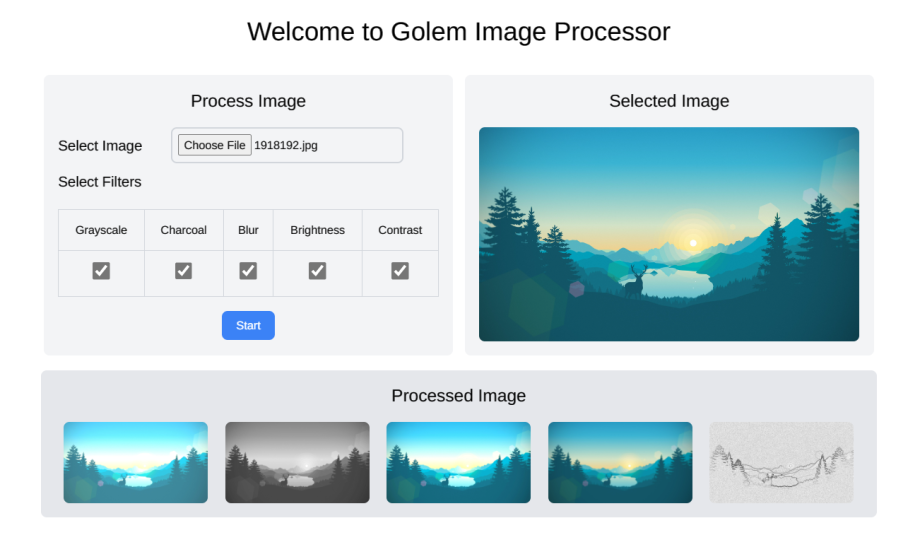

# Golem JS Preview Program Feedback Form

## Introduction

Thank you for taking the time to complete this Golem JS Preview Program task!

We appreciate your valuable feedback and suggestions on how to improve the Golem Network.
Please fill out the form below:

## Task #7 - Requestor in browser

### Estimated completion time

| Task Step                                    | Completion Time (in minutes) |
| -------------------------------------------- | ---------------------------- |
| Create the web page                          | 20                           |
| Integrate the requestor script with the page | 30                           |

List any additional steps that were necessary to resolve the task (other than the steps in the README.md):

> -   First of all I experienced an issue with running the requestor script in the browser. The actual issue was of app key however I was constantly getting CORS errors inside the browser. After long debugging sessions I found out (with Jack's help from your side in a online session. I enjoyed the converstaion btw.) that the issue was related to app key. The error message could have been made more helpful.
> -   After resolution of this initial issue there were some issues with the Golem Network (relay service connection timing out on new versions of yagna). That I had to look up and further investigate.
> -   **I would like to once again give a shoutout to Jack for helping me out with these and many other issues.**

### Feedback

#### JS SDK Docs

Could you find the necessary information? If not what topics were difficult to find?

> Yes all the necessary information was easily accesible in the docs.

---

How would you change the structure/navigation of the docs? Recommend changes.

> The organization of docs is very clean and intuitive with back and forth links to related topics / pages.

---

Are examples and tutorials useful? What was missing, and what was too detailed or unnecessary?

> The examples are useful in general but I would recommend adding more details to some of the sections. For example there should be a detailed section about app keys and their related issues / workarounds.

---

Have you noticed any errors? Please describe them or provide links to issues if you have already reported them.

> I have not encountered any issues / errors. But one thing that was misleading for me was about the default 'try_golem' app key. Here's a snipped from the docs.

But it did not work as expected.

#### JS golem-js

Is JS SDK API intuitive and helps solve the tasks? If not, what would you change?

> The SDK is very simple and doesn't get in the way of creafting complex distributed workloads. The minimalistic approach that is taken by the SDK team makes the life of application developers very easy.

---

Have you encountered any errors in the golem-js lib? Provide the link(s) to the issue(s) in `golem-js` [repository](https://github.com/golemfactory/golem-js/issues) which you had reported.

> As I mentioned above, there was an error during the initial setup for this task. I can't say with full confidence whether it was an issue with the SDK or the yagna service. But still I think it needs to be resolved. The problem was that the app key was not set properly but the error suggested CORS issue. I've talked to Jack at length about this in our session.

---

What additional features would you add?

> For running tasks from the browser, I would suggest adding some helper functions for handling upload and download of data because at this time the user has to serialize and deserialize data by hand which is error prone in many cases. The exact implementation and desired functionality is debatable but it would be a pretty sought after feature for developers.

#### General feedback

What was your general experience with Golem Network? What was difficult/frustrating?
What was a nice surprise?

> Up till now I have found golem network to be fairly stable and effecient. However for this task I experienced some network issues (these were general issues on the golem network as a whole not particularly for me).

---

In what projects could you utilize Golem Network?

> There are many use cases. I have described this at length in previous tasks.

#### Preview Program

Were the tasks and instructions adequate and clear?

> The instructions for this task were adequate.

---

Is there anything you would improve about the JS Preview program?

> Feedback submitted in the previous tasks.

---

Thank you for your feedback and for contributing to the Golem Network!
